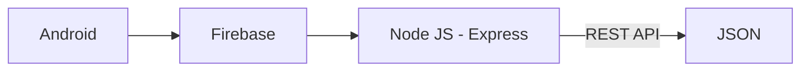

# JelaJava Backend APIs Repository

## Team Profile

| Bangkit ID  | Name                    | Learning Path   | LinkedIn                                                           |
| ----------- | ----------------------- | --------------- | ------------------------------------------------------------------ |
| C226DSX0608 | Albertus Alan Mehetabel | Cloud Computing | [Click Here](https://www.linkedin.com/in/albertus-alan-mehetabel/) |
| C360DKX4276 | Deva Raja               | Cloud Computing | [Click Here](https://www.linkedin.com/in/deva-raja/)               |

## Flow Chart

