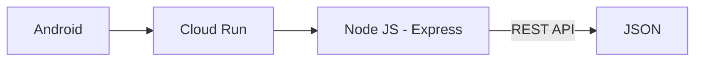

# JelaJava Backend APIs Repository

## Team Profile

| Bangkit ID  | Name                    | Learning Path   | LinkedIn                                                           |
| ----------- | ----------------------- | --------------- | ------------------------------------------------------------------ |
| C226DSX0608 | Albertus Alan Mehetabel | Cloud Computing | [Click Here](https://www.linkedin.com/in/albertus-alan-mehetabel/) |
| C360DKX4276 | Deva Raja               | Cloud Computing | [Click Here](https://www.linkedin.com/in/deva-raja/)               |

## Description

The JelaJava backend API is a part of the JelaJava application that aims to provide backend services that can be accessed through APIs. This backend allows users to perform operations such as user authentication, user note management, note search, maps data retrieval, weather data retrieval, machine learning data retrieval, and other features.

The JelaJava API is documented using Swagger, so users can easily understand and access the available endpoints. The API documentation can be accessed via [/api-docs](https://node-api-froi2bfpmq-et.a.run.app/api-docs/) from the [main URL](https://node-api-froi2bfpmq-et.a.run.app/) of the backend.

The backend is built using Node.js and Express.js as the main framework, while Firebase Firestore is used as a database to store user data.

Some of the main features available in the JelaJava API backend include:

- User authentication using JWT (JSON Web Token) tokens.
- User management
- Management of user's notes, including creation, update and deletion of notes.
- Searching notes by title.
- Retrieval of weather data based on input.
- Retrieval of maps data based on input
- Retrieval of recommendations based on data from machine learning.

## Flow Chart

## How To Run This API

1.  Clone this [repository](https://github.com/AlbertusAlanMehetabel/JelaJava/tree/backend)
2.  Make your own Firebase and Cloud Bucket credentials
3.  Configure the environment variable
4.  Go to this project's root directory
5.  Open your favorite terminal
6.  Type npm install and hit enter
7.  Type npm run start-dev
8.  It will run on http://localhost:3000
